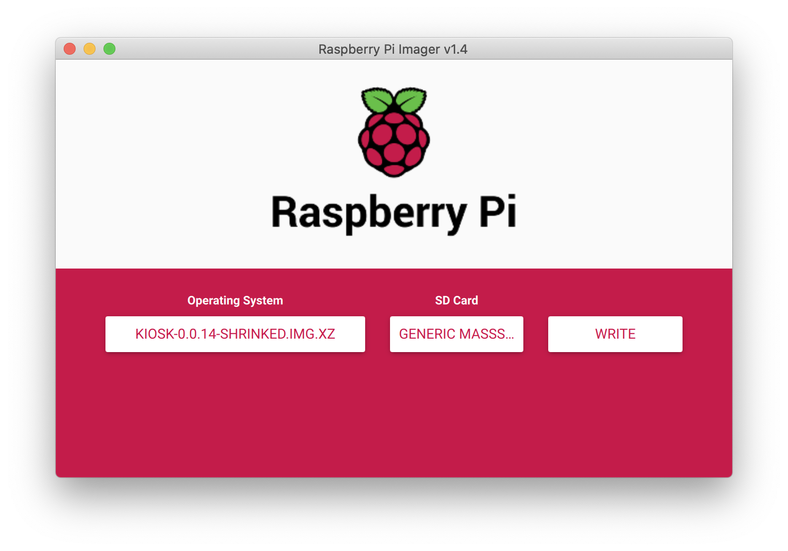

# Kiosk OS on Raspberry Pi 

This document contains the instructions that you need to follow in order to get Kiosk up and running on a Raspberry PI device.

## Prerequisites 
- A Raspberry Pi 4
- A microSD card (minimum 8GB)
- Raspberry Pi Imager ([download](https://www.raspberrypi.org/software/)) 

## Download Kiosk OS

You can download the latest Kiosk OS image from [our release page](https://github.com/kihosk/kiosk-raspberry/releases). 

## Install

Use Raspberry Pi Imager to flash your microSD card. Select the previously downloaded image file (for example `kiosk-0.0.14-shrinked.img.xz`) and select your microSD card. The process will take a few minutes, and you will be notified when it's done.

## Run

Plug the microSD card into the Raspberry Pi device. Turn on the power and in a few minutes Kiosk will be ready to use. 
